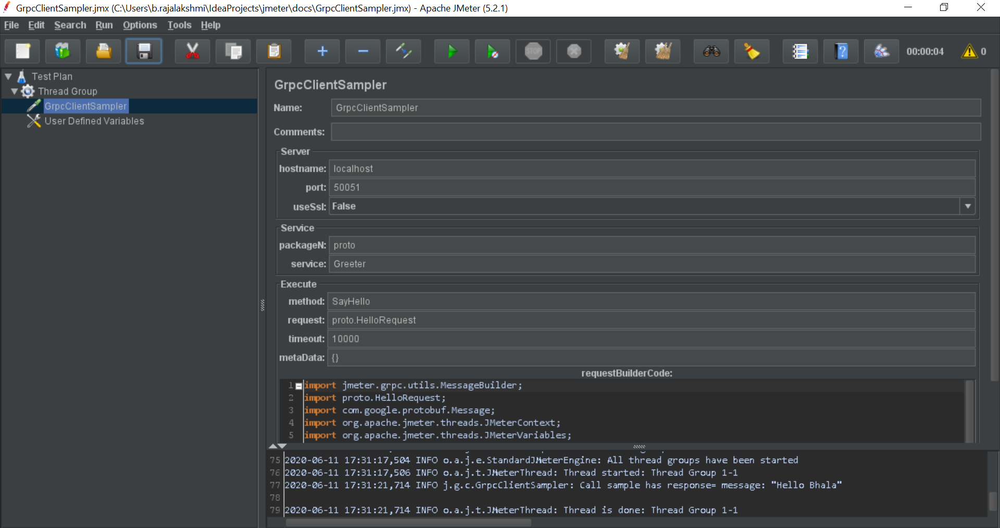

#### Reference: https://github.com/zalopay-oss/jmeter-grpc-plugin
# Huge thanks to this team

# Jmeter Grpc Plugin
A Jmeter plugin supports load test grpc service.

## Prerequisites

* Apache Jmeter (version >= 5.2)
* Apache Maven (version >= 3.6.0)
* Java (version >= 8)
* Protoc (version >= 3.11.4)
* Go (version >= 1.13.8)


## Short Description
This project repository has been created for jmeter grpc plugin to validate the performance of grpc services.

## Tech Stack:
1. Java8 (OpenJDK8) for programming
2. Maven for dependencies (refer pom.xml)

## Steps to get the JAR:
1. Place the .proto file under ~/docs/example/grpc-lib/src/main/proto folder
2. if your protobuf file doesn't contain the following statements in it, please add them:
```
option java_multiple_files = true;

option java_package = "_<package name here it is proto>_";

option java_outer_classname = "*<protoname>*Proto";

option objc_class_prefix = "HLW";
```
3. In a terminal window, navigate to ~/docs/example/grpc-lib folder
4. Enter the command ```mvn package```
5. This will output the target directory with necessary java files
6. Take all the .java files from the following directories and place them all under the ~/src/main/java/proto folder
    a. ~/docs/example/grpc-lib/target/generated-sources/protobuf/grpc-java/proto
    b. ~/docs/example/grpc-lib/target/generated-sources/protobuf/java/proto
7. Run the maven command as ```mvn clean install``` to get the JAR under the ~/target folder
8. Copy the JAR and place it under path_to_jmeter/lib/ext folder
9. Open the jmeter.bat file under path_to_jmeter folder
10. Once Jmeter is opened, add the following libraries to classpath in Test Plan:
    
    a. jmeter-grpc-plugin.jar (from this project)
    
    b. grpc-api-1.29.0.jar (from ~\.m2\repository\io\grpc\grpc-api\1.29.0)
    
    c. grpc-netty-1.29.0.jar (from ~\.m2\repository\io\grpc\grpc-netty\1.29.0)
    
    d. grpc-netty-shaded-1.29.0.jar (from ~\.m2\repository\io\grpc\grpc-netty-shaded\1.29.0)
    
    e. grpc-okhttp-1.29.0.jar (from ~\.m2\repository\io\grpc\grpc-okhttp\1.29.0)
       
11. Right click on Test Plan --> Add --> Thread (Users) --> Thread Group
12. Right click on Thread Group --> Add --> Sampler --> GrpcClientSampler
13. Add the details as in example to fire your grpc

* Example: 

[GrpcClientSampler.jmx](./docs/GrpcClientSampler.jmx)

[jmeter-grpc-plugin.jar](./docs/jmeter-grpc-plugin.jar)

## Screenshots of jmeter gRPC plugin:


### How to run the hello server locally
1. Open the ~/docs folder in terminal
2. Run the command ```./scripts/runserver.sh``` 

### Details:
##### Hello World Greeter gRPC SayHello RPC
hostname: localhost

port: 50051

useSsl: False

package: proto

service: Greeter

method: SayHello

request: proto.HelloRequest

##### RequestBuilderCode:

```
import jmeter.grpc.utils.MessageBuilder;
import proto.HelloRequest;
import com.google.protobuf.Message;
import org.apache.jmeter.threads.JMeterContext;
import org.apache.jmeter.threads.JMeterVariables;

public class RequestFactory implements MessageBuilder {
	public Message buildMessage(JMeterContext jmctx) {
		JMeterVariables vars = jmctx.getVariables();
		HelloRequest request = HelloRequest.newBuilder().setName(vars.get("Name")).build();
		return request;
	}
}
```